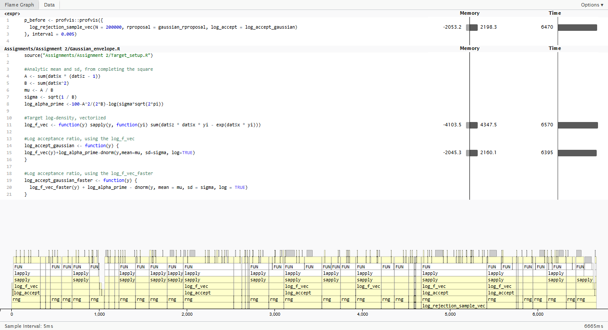
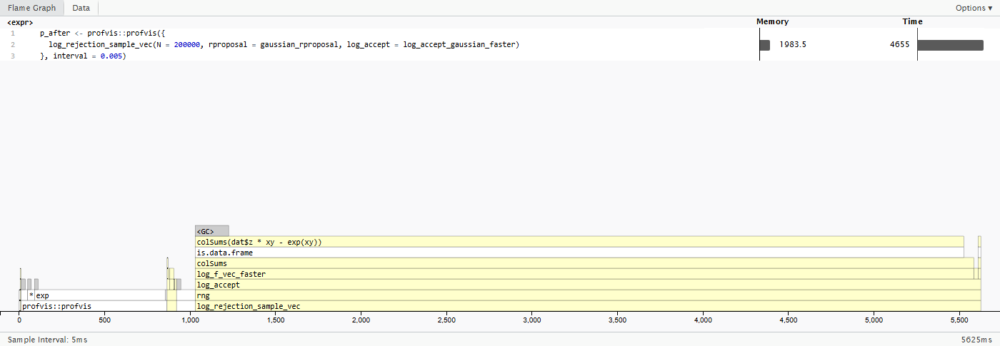
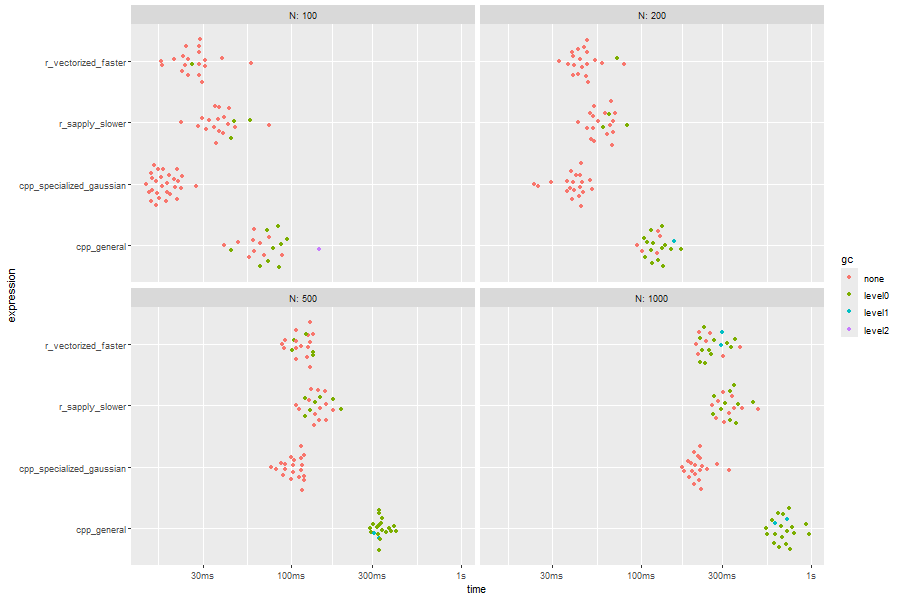
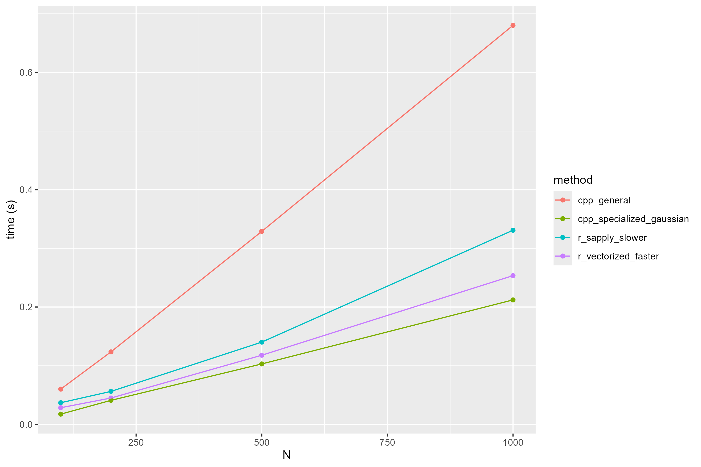
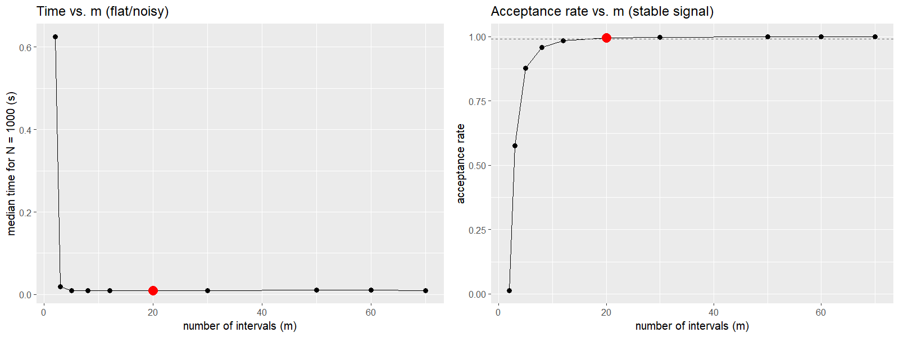
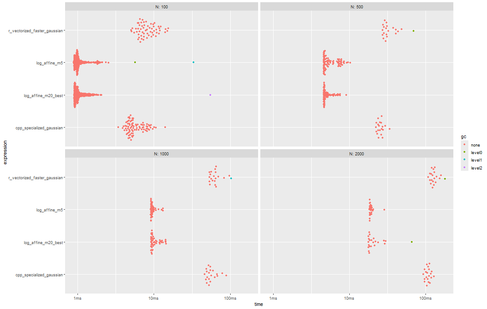
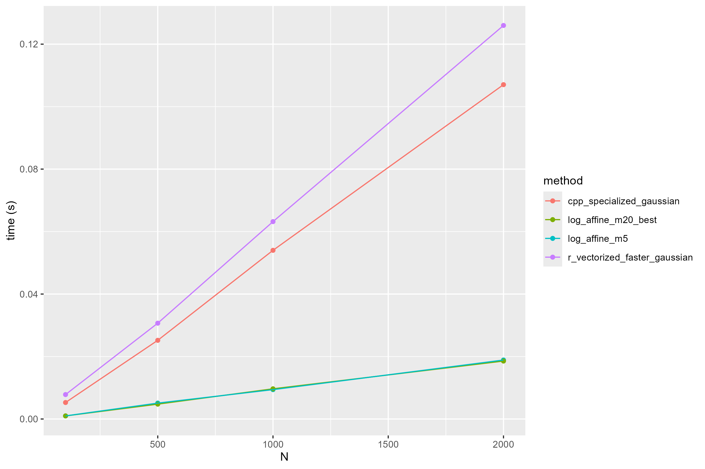

## Overview

- The target distribution

- Method 1: Gaussian envelope

- Method 2: Piecewise log-affine envelope

- Comparison

## The Target Distribution

We want to sample from

$$
f(y) \propto q(y) = \exp\left(\sum_{i=1}^{m} (y z_i x_i - e^{y x_i})\right) \mathbf{1}_{\{y \geq 0\}}, \quad m = 100
$$

- Data: 100 observations $(z_i, x_i)$, with $x_i > 0$

**Goal:** sample from $f$ via rejection sampling, using two different envelope constructions

- A Gaussian envelope
- A piecewise log-affine envelope

## Why a Gaussian Envelope?

We look for a Gaussian density $p$ that dominates $q$ up to a constant, $\alpha' q(y) \leq p(y) \Leftrightarrow \log(q(y))\leq log(p(y)) - \log(\alpha')$.

We have that the log of the Gaussian density is

$$
\log p(y) = -\frac{1}{2}\log(2\pi\sigma^2) - \frac{(y-\mu)^2}{2\sigma^2}.
$$

## Deriving the Envelope

Since $yx_i \geq 0$, the inequality $e^t \geq 1 + t + t^2/2$ gives

$$
\log q(y) = \sum_{i=1}^{100}(yz_ix_i-e^{yx_i}) \leq -100 + Ay - \frac{B}{2}y^2
$$

$$
= -100 + \frac{A^2}{2B} - \frac{B}{2}\left(y - \frac{A}{B}\right)^2
$$

where $A = \sum^{100}_{i=1} x_i(z_i - 1)$ and $B = \sum_{i=1}^{100} x_i^2$.

Matching to $-\dfrac{(y-\mu)^2}{2\sigma^2}$ gives $\mu = A/B$, $\sigma^2 = 1/B$. Our $p(y)$ is the **normalized** Gaussian density, so:

$$
\boxed{\alpha' = \exp\left(100 - \frac{A^2}{2B}\right) \Big/ \left(\sigma\sqrt{2\pi}\right)}
$$

## First Implementation: Gaussian Envelope

```{=latex}
\scriptsize
```

``` r
#A <- sum(dat$x * (dat$z - 1))    ,     B <- sum(dat$x^2),
# mu <- A / B  ,    sigma <- sqrt(1 / B)
log_alpha_prime <- 100 - A^2 / (2 * B) - log(sigma * sqrt(2 * pi))

log_f_vec <- function(y) {
  sapply(y, function(yi) sum(dat$z * dat$x * yi - exp(dat$x * yi)))
}
log_accept_gaussian <- function(y) {
  log_f_vec(y) + log_alpha_prime -
    dnorm(y, mean = mu, sd = sigma, log = TRUE)
}
gaussian_rproposal <- function(n) {
  rnorm(n, mean = mu, sd = sigma)
}       
log_rejection_sample_random <- function(N, rproposal, log_accept) {
y <- rproposal(N)
u <- runif(N)
accept <- log(u) <= log_accept(y)
y[accept]
}
log_rejection_sample_vec <- rng_vec(log_rejection_sample_random)
```

```{=latex}
\normalsize
```

## Correctness Check: N = 1000 Samples

```{r}
#| echo: false
#| fig-width: 6.5
#| fig-height: 4
#| fig-align: center
setwd(rprojroot::find_root(rprojroot::is_vcs_root))
source("Assignments/Assignment 2/Target_setup.R")
A <- sum(dat$x * (dat$z - 1)); B <- sum(dat$x^2)
mu <- A / B; sigma <- sqrt(1 / B)
log_alpha_prime <- 100 - A^2/(2*B) - log(sigma*sqrt(2*pi))
log_accept_gaussian_faster <- function(y) log_f_vec_faster(y) + log_alpha_prime - dnorm(y, mean = mu, sd = sigma, log = TRUE)
gaussian_rproposal <- function(n) rnorm(n, mean = mu, sd = sigma)
log_rejection_sample_random <- function(N, rproposal, log_accept) {
  y <- rproposal(N); u <- runif(N); y[log(u) <= log_accept(y)]
}
log_rejection_sample_vec <- rng_vec(log_rejection_sample_random)

set.seed(1)
samples <- log_rejection_sample_vec(1000, rproposal = gaussian_rproposal, log_accept = log_accept_gaussian_faster)
unnorm_f_vec <- function(y) exp(log_f_vec_faster(y))
Z <- integrate(unnorm_f_vec, lower = 0, upper = Inf)$value
target_density <- function(y) unnorm_f_vec(y) / Z
scaled_envelope <- function(y) exp(-log_alpha_prime) * dnorm(y, mean = mu, sd = sigma) / Z
peak_height <- max(scaled_envelope(seq(0, 1, length.out = 500)))

hist(samples, breaks = 30, freq = FALSE, ylim = c(0, peak_height * 1.35),
     main = "Samples vs target vs envelope", xlab = "y")
curve(target_density, add = TRUE, col = "red", lwd = 2)
curve(scaled_envelope, add = TRUE, col = "darkgreen", lwd = 2)
legend("topright", legend = c("target density", "scaled envelope"),
       col = c("red", "darkgreen"), lwd = 2, bty = "n")

y_check <- gaussian_rproposal(200000)
u_check <- runif(200000)
empirical_rate <- mean(log(u_check) <= log_accept_gaussian_faster(y_check))
```

**Empirical acceptance rate** (fraction accepted out of 200,000 raw proposals): `r round(empirical_rate, 4)`

## Profiling: Where Does the Time Go?

Profiling `log_rejection_sample_vec` (200,000 samples) with `Rprof`:

```{=latex}
\scriptsize
```

``` r
profvis::profvis({
  log_rejection_sample_vec(
    N = 200000,
    rproposal = gaussian_rproposal,
    log_accept = log_accept_gaussian)
})
```

```{=latex}
\normalsize
```

{width="90%"}

**98.5% of self time is on one line** — not the math itself, but calling a fresh R closure once per proposal via `sapply`.

## Vectorizing `log_f`

```{=latex}
\scriptsize
```

With a 13.4% acceptance rate, roughly 1.5 million proposals get evaluated to produce 200,000 accepted samples, each one re-running `sapply` and re-fetching `dat$z`/`dat$x` from scratch.

**Idea:** replace the one-proposal-at-a-time `sapply` with a single matrix computation covering *all* proposals in a batch at once.

``` r
log_f_vec_faster <- function(y) {
  xy <- outer(dat$x, y)         # xy[i,j] = x_i * y_j
  colSums(dat$z * xy - exp(xy))
}
```

- Exact same output as the original (verified: zero difference)
- **1.44**$\times$ faster for the full sampler (19.7s $\to$ 13.7s at N = 200{,}000)

**Profiling `log_f_vec_faster`:** the `sapply` bottleneck is gone — runtime is now genuinely inside the vectorized math itself:

{width="90%"}

```{=latex}
\normalsize
```

## Two C++ Implementations

```{=latex}
\tiny
```

::::: columns
::: {.column width="50%"}
**General** (callback into R for every proposal):

``` cpp
NumericVector rejection_sample_cpp(
    int N, Function rproposal, Function log_accept) {
  NumericVector out(N);
  double y;
  bool reject;

  for (int i = 0; i < N; ++i) {
    do {
      y = as<double>(rproposal(1));
      reject = log(R::runif(0, 1)) >
        as<double>(log_accept(y));
    } while (reject);
    out[i] = y;
  }

  return out;
}
```
:::

::: {.column width="50%"}
**Specialized** (target/envelope hardcoded, zero R calls):

``` cpp
NumericVector gaussian_rejection_cpp(
    int N, NumericVector z,
    NumericVector x, double mu,
    double sigma, double log_alpha_prime) {
  int n = z.size();
  NumericVector out(N);
  double y, log_fy, log_gy;
  bool reject;

  for (int i = 0; i < N; ++i) {
    do {
      y = R::rnorm(mu, sigma);
      log_fy = 0.0;
      for (int k = 0; k < n; ++k)
        log_fy += z[k]*x[k]*y - exp(x[k]*y);
      log_gy = R::dnorm(y, mu, sigma, true);
      reject = log(R::runif(0, 1)) >
        (log_fy + log_alpha_prime - log_gy);
    } while (reject);
    out[i] = y;
  }

  return out;
}
```
:::
:::::

```{=latex}
\normalsize
```

## Benchmarking All Four Versions

{width="85%"}

The CPP: Generality costs speed, since the general version pays R-callback overhead on *every* proposal.

## Benchmarking Across N

{width="75%"}

- `cpp_specialized_gaussian` and `r_vectorized_faster` stay close together
- `cpp_general` scales the worst, `r_sapply_slower` (original) is a clear second-worst

## Piecewise Log-Affine Envelope

Following Section 6.2.1: write $\ell(y) = \log q(y)$. Then

$$
\ell'(y) = \sum_i x_i(z_i - e^{yx_i}), \qquad \ell''(y) = -\sum_i x_i^2 e^{yx_i} < 0.
$$

So $\ell$ is **concave** — this is exactly what makes the tangent-line construction valid: a tangent line to a concave function always lies *above* it.

The tangent at $t_j$ has slope $a_j = \ell'(t_j)$ and intercept $b_j = \ell(t_j) - a_j t_j$.

## Building the Envelope

Adjacent tangents intersect at

$$
c_j = \frac{b_{j+1} - b_j}{a_j - a_{j+1}}.
$$

With $c_0 = 0$ and $c_k = \infty$, these define the pieces. The lowest tangent gives $V(y) = a_j y + b_j$ on $[c_{j-1}, c_j]$, hence

$$
q(y) \leq e^{V(y)}.
$$

Tangency means equality at the chosen points $\Rightarrow$ we can use $\alpha' = 1$ exactly.

## Sampling from the Envelope

For a piece with endpoints $L, R$, its area is

$$
R_j = e^{b_j}\frac{e^{a_j R} - e^{a_j L}}{a_j} \qquad \text{(or } e^{b_j}(R-L) \text{ if } a_j = 0\text{)}.
$$

- These areas give the piecewise-exponential CDF, inverted per-piece to sample
- The last slope must be negative for the unbounded right tail to be integrable

## How Many Intervals?

The book gives no formula — only a qualitative trade-off:

> "By increasing the number of $z$'s we can make this envelope as tight as we want. This will lower the rejection probability but also increase the complexity of simulating from the proposal."

Our own measurements confirm this is genuinely an empirical question, not a closed-form one — very few points is clearly bad, but beyond a modest number, more points barely help while adding overhead.

## Implementing the Log-Affine Envelope (1/2)

Building the piecewise tangent-line majorant and evaluating it at a point:

```{=latex}
\scriptsize
```

``` r
build_envelope <- function(y_points) {
  y_points <- sort(y_points)
  m <- length(y_points)
  a <- log_f_prime_vec(y_points)
  b <- log_f_vec_faster(y_points) - a * y_points
  z <- (b[-1] - b[-m]) / (a[-m] - a[-1])       # tangent intersections c_j
  list(a = a, b = b, z = c(0, z, Inf))
}

eval_V <- function(envelope, y) {
  i <- findInterval(y, envelope$z)
  envelope$a[i] * y + envelope$b[i]
}
```

```{=latex}
\normalsize
```

Since tangency gives equality at each $t_j$, $\alpha' = 1$ exactly — no separate normalizing-constant step needed.

## Implementing the Log-Affine Envelope (2/2)

Sampling from the piecewise-exponential envelope, then the accept/reject step:

```{=latex}
\tiny
```

``` r
sample_from_envelope_vec <- function(envelope, n) {
  a <- envelope$a; b <- envelope$b; z <- envelope$z
  m <- length(a)
  R <- numeric(m)                              # per-piece area under exp(V)
  for (i in seq_len(m)) {
    lo <- z[i]; hi <- z[i + 1]
    R[i] <- if (is.infinite(hi)) -exp(a[i]*lo + b[i]) / a[i]
            else (exp(a[i]*hi + b[i]) - exp(a[i]*lo + b[i])) / a[i]
  }
  Q <- cumsum(R); d <- Q[m]
  target_area <- runif(n) * d
  i <- pmin(findInterval(target_area, Q) + 1, m)
  Q_full <- c(0, Q)
  area_into_piece <- target_area - Q_full[i]
  rhs <- area_into_piece * a[i] + exp(a[i] * z[i] + b[i])
  (log(rhs) - b[i]) / a[i]                     # invert piecewise-exp CDF
}

sample_fixed_random <- function(N, envelope) {
  y <- sample_from_envelope_vec(envelope, N)
  accept <- log(runif(N)) <= log_f_vec_faster(y) - eval_V(envelope, y)
  y[accept]
}
sample_fixed_vec <- rng_vec(sample_fixed_random)
```

```{=latex}
\normalsize
```

## Finding the Best Number of Intervals

A fixed, non-adaptive grid of $m$ tangent points, spaced over $[0, \hat{y} + 3\hat{\sigma}]$ (mode $\pm$ curvature-based spread). More points $\Rightarrow$ higher acceptance rate, but each proposal also costs more to build/sample from.

```{=latex}
\scriptsize
```

``` r
time_for_m <- function(m, N, min_iterations = 5) {
  y_points <- seq(0.02, y_hat + 3 * sd_hat, length.out = m)
  envelope <- build_envelope(y_points)
  b <- bench::mark(
    sample_fixed_vec(N, envelope = envelope),
    min_iterations = min_iterations, check = FALSE
  )
  data.frame(m = m, time = as.numeric(b$median), acceptance_rate = ...)
}

find_best_m <- function(candidate_ms, N, min_iterations = 5, acc_threshold = 0.99) {
  results <- do.call(rbind, lapply(candidate_ms, time_for_m, N = N,
                                    min_iterations = min_iterations))
  above <- results[results$acceptance_rate >= acc_threshold, ]
  list(results = results, best = above[which.min(above$m), ])
}

out <- find_best_m(c(2, 3, 5, 8, 12, 20, 30, 50, 60, 70), N = 1000, min_iterations = 30)
```

```{=latex}
\normalsize
```

```{r}
#| echo: false
#| include: false
setwd(rprojroot::find_root(rprojroot::is_vcs_root))
source("Assignments/Assignment 2/Log-affine_envelope.R")
# The m = 5..70 sweep is noisy (the timings are all close together), so
# re-running it here would pick a different "best m" than the one marked on
# sweep_plot.png. Use the cached result instead, so the slide text, the
# static plot, and the correctness-check histogram all agree.
out <- readRDS("Assignments/Assignment 2/Presentation 2/best_m.rds")
```

## How the Best m Was Chosen

{width="100%"}

Time (left) drops sharply from $m=2$ to $m=5$, then is flat and noisy — re-running the sweep does not reliably pick the same argmin. Acceptance rate (right) is monotone and stable, so we take the smallest $m$ crossing 99% (dashed line): $m =$ `r out$best$m` (red point).

## Correctness Check: Log-Affine Envelope

```{r}
#| echo: false
#| fig-width: 9
#| fig-height: 4.2
#| fig-align: center
par(mfrow = c(1, 2))
plot_log_affine_correctness(m = 5)
plot_log_affine_correctness(m = out$best$m)
par(mfrow = c(1, 1))
```

With $m = 5$ the envelope is visibly loose (lower acceptance rate); at the best $m$ it hugs the target density much more tightly.

## Benchmarking: Log-Affine vs. Gaussian

{width="70%"}

Comparing all four methods at N = 100, 500, 1000, 2000 (min. 20 iterations each) — both log-affine variants are consistently faster than either Gaussian implementation, and the gap widens as N grows.

## Benchmarking Across N

{width="60%"}

Both log-affine variants beat `cpp_specialized_gaussian` and `r_vectorized_faster_gaussian` at every N, and the gap widens as N grows.

## Benchmarking Across N: Why

**Acceptance rate decides the speed — not the language.**

| Method | Acceptance |
|---|---|
| Gaussian envelope (R or C++) | $\approx$ 13% |
| Log-affine, $m=5$ | 87.7% |
| Log-affine, best $m$ | 99.5% |

## Questions & Further Work

**Questions?**

**Further work:**

- The log-affine sampler is still written in R, while the Gaussian envelope also has a C++ version. Rewriting the log-affine sampler in C++ could make it even faster
- We placed the tangent points evenly spaced across the range. This may not be the best choice — spacing them based on where the curve is more curved could give a tighter envelope with fewer points